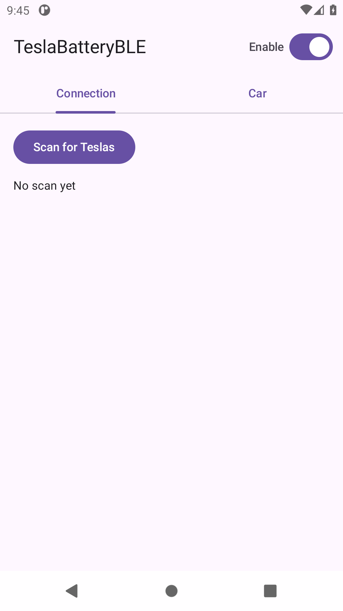
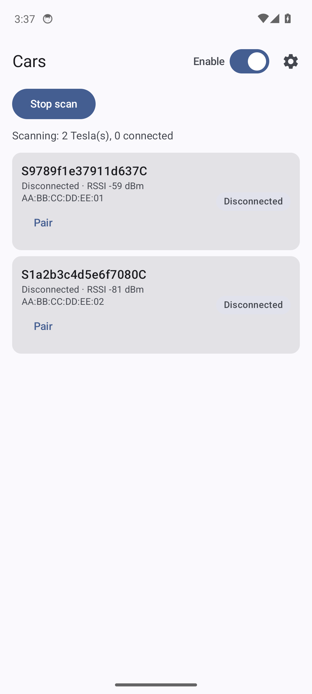
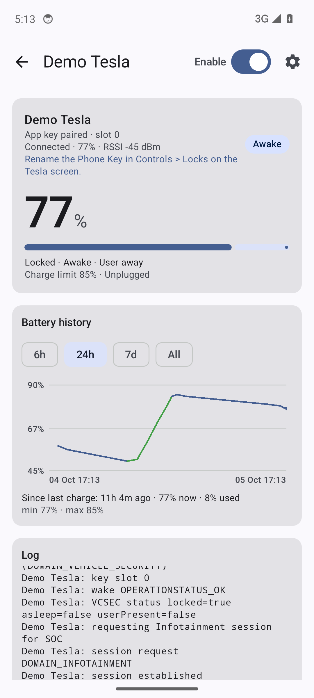
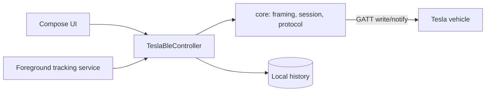

# TeslaBatteryBLE

**Your Tesla's battery, tracked locally over Bluetooth LE. No cloud, no account, nothing leaves the phone.**

[](https://github.com/dzid26/TeslaBatteryBLE/actions/workflows/android.yml)
[](LICENSE)
-green.svg)
[](docs/master-plan.md)

TeslaBatteryBLE talks to a Tesla over Bluetooth LE using an enrolled vehicle key —
the same local protocol Tesla's [`vehicle-command`](https://github.com/teslamotors/vehicle-command)
uses. No Tesla account, no virtual-key cloud registration, no telemetry. Install the
app, pair a key with an NFC card tap on the console, and read the car directly.

## Screenshots

| Overview | Scanning | Car |
| --- | --- | --- |
|  |  |  |

## Features

- **Scan & connect** to nearby Teslas by advertised BLE name, with VIN-based hinting
- **Pair a key** (CHARGING_MANAGER role by default) via Tesla's unsigned `addKey` flow: NFC card tap on the console + vehicle confirmation
- **Read battery SOC** and charge state over an authenticated, encrypted session
- **On-demand wake** — the car is only woken when you ask, never in the background
- **Background tracking** via a foreground service: SOC timeline and connection state while parked or charging
- **History graph** (6 h / 24 h / 7 d / all) with since-last-charge stats
- **Simulated car** in debug builds for development without a vehicle or hardware (demo/screenshot mode)

Everything is computed on-device. The app has no internet permission.

## Coming next

Local battery-health analytics (capacity estimation from charge sessions and rated
range, charging-efficiency and parked-drain insights, habit cards), then an optional
OBD path for pack-level data. See:

- [`docs/master-plan.md`](docs/master-plan.md) — phases and scope
- [`docs/research/feature-map.md`](docs/research/feature-map.md) — battery-health feature synthesis

## Install

### GitHub Releases (preview channel)

The rolling [preview release](https://github.com/dzid26/TeslaBatteryBLE/releases/tag/preview)
is rebuilt from `main` on every push. **Preview APKs are debug builds** — installable
side by side with a future stable release, but do not treat them as production-signed.

### Obtainium (auto-updates from GitHub)

1. Open [Obtainium](https://github.com/ImranR98/Obtainium) → **Add App**
2. URL: `https://github.com/dzid26/TeslaBatteryBLE`
3. Enable **Include prereleases** (the preview channel is a prerelease)
4. Install and let Obtainium track new previews

Signed stable releases and F-Droid are on the [roadmap](docs/master-plan.md).

## Build from source

Requirements: JDK 21 (Temurin recommended), Android SDK 35, Git.

```bash
./gradlew :app:assembleDebug        # debug APK
./gradlew :core:test                # protocol unit tests (no device needed)
./gradlew :app:testDebugUnitTest    # app unit tests (simulated car)
./gradlew :app:lintDebug            # Android lint
```

On Windows, use `.\gradlew` instead of `./gradlew`. The debug APK lands in
`app/build/outputs/apk/debug/`.

CI (`.github/workflows/android.yml`) runs the core tests, app unit tests, lint, a
debug build, a Go-fixture diff against `teslamotors/vehicle-command`, and publishes
the rolling preview release with emulator screenshots.

## Architecture

| Module | Purpose |
| --- | --- |
| `core/` | Pure-JVM Kotlin protocol implementation: BLE framing, session handshake, pairing, VCSEC/Infotainment messages (Tesla protos via Wire). No Android dependencies. |
| `app/` | Android UI (Compose), BLE integration (`BluetoothGatt`), foreground tracking service, history storage. |
| `tools/go-fixtures` | Deterministic fixtures generated against the Go reference implementation and diffed in CI. |



Protocol details: [`docs/protocol/`](docs/protocol/). Architecture decisions:
[`docs/adr/`](docs/adr/).

## Contributing

Contributions are welcome. Start with [`CONTRIBUTING.md`](CONTRIBUTING.md) — dev
setup, module map, test expectations, and the DCO sign-off (no CLA). Issues and
pull requests use templates in [`.github/`](.github/).

## Security & privacy

- [`SECURITY.md`](SECURITY.md) — how to report vulnerabilities privately
- [`PRIVACY.md`](PRIVACY.md) — what the app does (and deliberately does not do) with data

## Support

TeslaBatteryBLE is free, ad-free, and telemetry-free. If it's useful to you, you
can support development via [GitHub Sponsors](https://github.com/sponsors/dzid26).
Donations help cover development costs (test hardware, tooling) and keep the
project independent.

## License

TeslaBatteryBLE is licensed under the **GNU Affero General Public License v3.0 only**
([AGPL-3.0-only](LICENSE)). Third-party components and ported protocol definitions are
listed in [`THIRD_PARTY_NOTICES.md`](THIRD_PARTY_NOTICES.md).

> Not affiliated with, endorsed by, or sponsored by Tesla, Inc. "Tesla" is a
> trademark of Tesla, Inc., used here only to describe interoperability.
